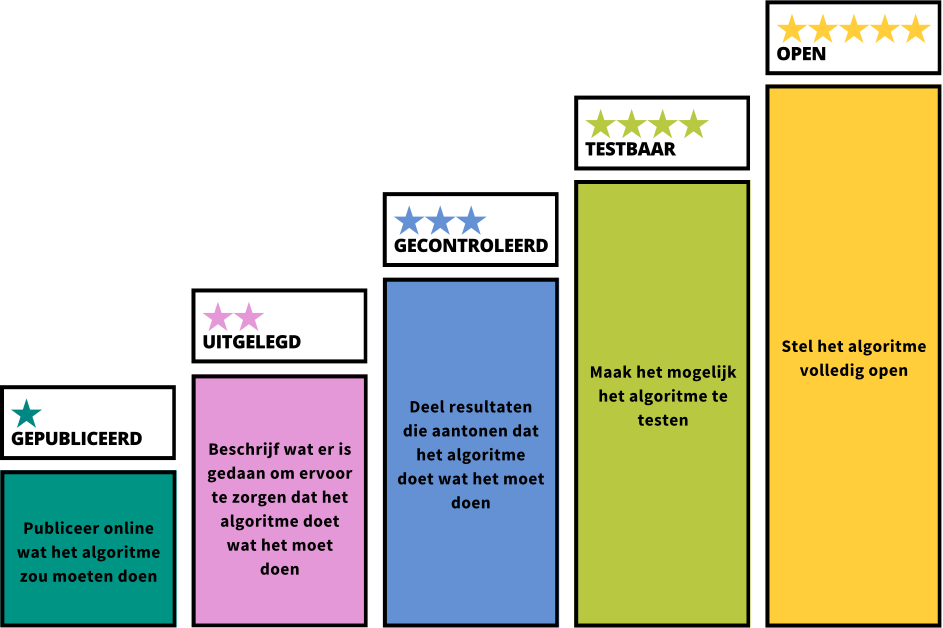

# **Zijn jouw algoritmes al 5 sterren?**

Geïnspireerd op het 5 sterren-model voor Open Data (van Tim Berners-Lee) presenteren we het 5 sterren-model voor transparante algoritmes. Lees alles over de noodzaak, de uitdagingen en de achtergrond van dit model in ons [whitepaper](/whitepaper/). Of ga direct naar de toelichting op het [model](/model/).

