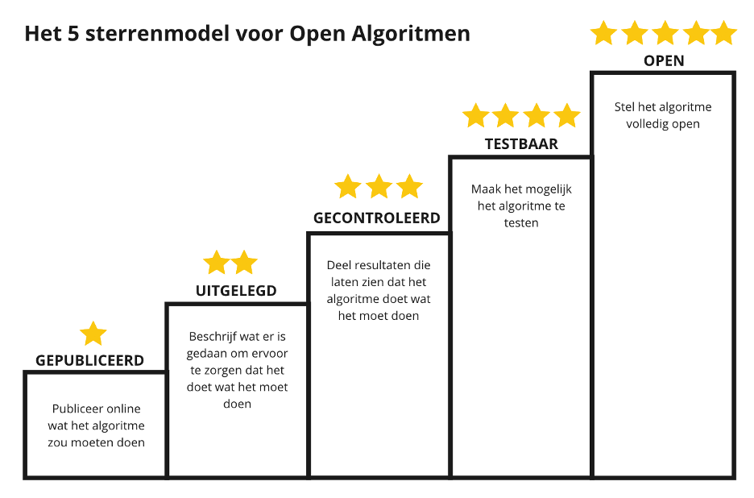

# Het 5 sterrenmodel

## 1★ GEPUBLICEERD
De eerste ster wordt behaald wanneer er überhaupt informatie over het algoritme en de toepassing door de organisatie publiek beschikbaar is, bij voorkeur in een “algoritmeregister”. Dat betekent een beschrijving van de algemene kenmerken van het algoritme, waarin de volgende onderdelen minimaal worden besproken:

- Beschrijving van het doel/de functie van het algoritme;

- Beschrijving van de rol van het algoritme in relatie tot het proces waarin het gebruikt wordt;

- Een risicoclassificatie van het algoritme.

Met deze informatie informeer je over het gebruik van het algoritme, waarom het wordt ingezet, welke risico’s er zijn, wat de (indirecte) impact is en welke keuze gemaakt zijn om bijvoorbeeld risico’s in te perken en waarborgen te stellen. Zodat individuen en andere stakeholders kunnen weten dat een algoritme ingezet wordt en kunnen bekijken hoe dit impact heeft. Deze informatie moet beschikbaar worden gesteld in begrijpelijke taal: B1-niveau.  

## 2★ UITGELEGD
Op dit niveau wordt beschreven wat er gedaan is/wordt om te zorgen dat het algoritme doet wat het moet doen. Er wordt hiervoor een beschrijving gegeven van hoe het algoritme is getraind, geoptimaliseerd en op bias is gecontroleerd. Denk hierbij bijvoorbeeld aan de volgende onderdelen:

- Een reflectie op normatieve keuzes en definities (bijv. de keuze voor een bepaalde eerlijkheidsdefinitie);

- Welke optimalisatiecriteria er gehanteerd worden;
  
- Welke beheersmaatregelen er toegepast zijn/gaan worden (bijv. testing/impact assessment);
  
- Wie of welke partijen verantwoordelijk zijn voor de life-cycle/toezicht/verbetering;
  
- Een stroomschema van de inputs en outputs gedurende het proces.

Met deze toelichting informeer je ook over de wijze waarop de werking en de effecten van het algoritme wordt gemonitord, zodat het algoritme blijft doen wat het moet. Hiermee biedt je transparantie over de gevolgen van de toepassing van het algoritme op de langere termijn, en op welke maatregelen of afspraken later geëvalueerd kan worden.

## 3★ GECONTROLEERD
Op dit niveau wordt niet alleen beschreven wat er gedaan is om te zorgen dat het algoritme doet wat het moet doen, maar kan dit ook aangetoond worden. Hierbij worden resultaten gedeeld die laten zien dat het algoritme  “goed” en  “eerlijk” werkt. Dit kan bijvoorbeeld aangetoond worden door het delen van:

- Auditresultaten;

- Monitoringsdata;

- Resultaten van ethische toetsing (bijv. van een eventuele ethische commissie, of een IAMA-traject (Impact Assessment Mensenrechten en
Algoritmes);

- Hoe het algoritme getest en gevalideerd is, en wat daarvan de resultaten zijn;

- Hoe ervoor gezorgd is dat de kwaliteit van de trainingsdata voldoende is, ook vanuit ethisch perspectief;

- Andere resultaten van de “checks en balances” die onderdeel vormen van de life-cycle.

Het aantonen van een “goede”  en “eerlijke” werking, helpt bij het opbouwen van extern vertrouwen in de werking en toepassing van een algoritme. Het geeft nader zicht op de validiteit en betrouwbaarheid van de gegeven informatie.

## 4★ TESTBAAR
Op dit niveau kunnen belanghebbenden zelf het algoritme gaan testen. Mensen kunnen dan zelf inzien welke output er geleverd wordt bij welke input. Dit kan bijvoorbeeld gerealiseerd worden middels:

- Een API waarmee resultaten opgevraagd kunnen worden;

- Een “mock-up” systeem (wanneer volledige openheid niet geboden kan worden uit b.v. veiligheidsoverwegingen);

- Test-data, eventueel “synthetisch” (niet de daadwerkelijk gevoelige data maar een vergelijkbare neutrale set)

Hiermee wordt het algoritme en de werking tastbaar en daarmee ook testbaar. Dat is een voorwaarde om een open gesprek te kunnen voeren over waarom het algoritme tot bepaalde uitkomsten komt, hoe deze resultaten geïnterpreteerd moeten worden, of deze uitkomsten wenselijk zijn, en (dus) of de toepassing van het algoritme in een bepaald proces verantwoord en gerechtvaardigd is. 

## 5★ OPEN
Op dit niveau is het algoritme volledig open. De code, data, beheersmaatregelen en ontwerpkeuzes zijn volledig inzichtelijk, uiteraard op een manier waarbij de privacy van de ontwikkelaars en andere betrokkenen niet wordt aangetast of voor onveilige situaties kan zorgen. De 5 sterren voor maximale openheid is bedoeld om experts of toezichthoudende partijen de mogelijkheid te geven om het algoritme volledig te doorgronden. Concreet kan dit bijvoorbeeld door middel van:

- Het beschikbaar stellen van de broncode in combinatie met contextuele informatie, zoals een “model card”

- Het beschikbaar stellen van de trainingsdata

- Het volledig transparant zijn over de door de organisatie gemaakte afwegingen en effecten m.b.t. de toepassing van het algoritme
