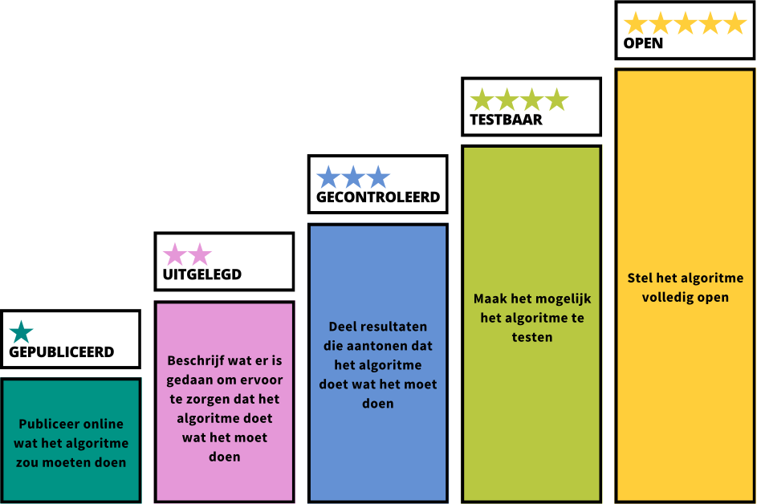

# Whitepaper

```
Door: de 5 sterren-community
Versie: 1.0 (d.d. 06 december 2024)
```
Ook te downloaden als pdf: [Whitepaper 5 sterren-model.pdf](img/Whitepaper 5 sterren-model.pdf)
## Van _black boxes_ naar transparante algoritmes

**Samenvatting:** Transparantie is een kernvoorwaarde voor verantwoorde inzet van algoritmes door overheden, maar dit wordt nog niet voldoende gerealiseerd. Er lijkt sprake van onduidelijkheid, handelingsverlegenheid, onvoldoende kennis en risicomijdend gedrag bij overheidsorganisaties als het om transparantie over algoritmes gaat. Ons onderzoek heeft uitgewezen dat transparantie in de praktijk concreet, behapbaar en veilig gemaakt moet worden. Daarom introduceren wij het 5 sterren-model: een raamwerk voor het stapsgewijs realiseren van transparantie. In dit whitepaper vertellen we alles over de noodzaak, de uitdagingen en de inhoud en toepassing van het model.

## 1.  De noodzaak van transparantie

**Algoritmegebruik door overheden is niet transparant, met maatschappelijke schade als gevolg**

De Algemene Rekenkamer concludeerde in 2021 in het rapport _Aandacht voor algoritmes_[^1] dat onvoldoende wordt toegezien op de kwaliteit en risico’s van de inzet van algoritmes door overheden. In hun meest recente onderzoek stelt de Rekenkamer zelfs dat de risico’s van het gebruik van algoritmes door overheden vaak worden onderschat. Ook is bij meer dan een derde van de deelnemende organisaties onduidelijk of het ingezette systeem überhaupt naar behoren presteert.[^2]

Dit leidt tot zorgen in de samenleving. Volgens de Algoritme Vertrouwensmonitor van 2023 is de afgelopen jaren het vertrouwen in algoritmes bij de overheid gedaald en geeft de helft van de bevolking aan te denken ‘dat uitvoeringsorganisaties niet eerlijk en transparant zijn over het gebruik van algoritmes’.[^3] In combinatie met nieuwe wetgeving vanuit de Europese Unie, zoals de AI-verordening, legt dit grote druk op de overheid om meer transparantie te bieden over het gebruik van algoritmes.

Transparantie – in de context van algoritmes – is als principe of vereiste sterk verankerd in wetgeving, beleid, richtlijnen en kaders.[^4] Deze documenten lijken te suggereren dat transparantie een soort moreel of maatschappelijk eindpunt is. Maar het is cruciaal om transparantie _niet als einddoel_ te zien, maar als een middel om hogere doelen te bereiken. Zo moet je als overheid altijd uitleg kunnen geven over hoe besluiten of beleid tot stand zijn gekomen. Als je daarbij een algoritme inzet, bijvoorbeeld om het proces (deels) te automatiseren, berekeningen te maken, of voorspellingen te doen, moet je dat algoritmische proces dus ook goed in kaart brengen en uit kunnen leggen. Alleen dán kun je als overheid verantwoording afleggen over de manier waarop taken worden uitgevoerd en wordt publiek toezicht op de kwaliteit en rechtvaardigheid mogelijk.[^5] Daarmee is transparantie een essentiële voorwaarde voor een goedwerkende democratie.

Eind 2022 is een mooie stap gezet met de lancering van het landelijke Algoritmeregister, waarin overheden over hun algoritmes kunnen publiceren.[^6] Mede dankzij de inspanningen rond het Algoritmeregister zijn overheidsorganisaties hierdoor al flink aan de slag gegaan. Toch is de informatie die in het register wordt opgenomen vaak nog van beperkte waarde en onvoldoende om verschillende doelgroepen daadwerkelijk inzicht te geven in de impact en werking van algoritmes. Zo zijn resultaten van impacttoetsen zelden in te zien en er wordt nauwelijks verwezen naar beschikbare broncode. Daardoor blijft het onduidelijk of algoritmes naar behoren werken en op een rechtvaardige manier in processen wordt ingezet. Bovendien staat het overgrote deel van de algoritmes met directe impact op de samenleving nog niet in het register.[^7] Daarom is extra actie nodig om de transparantie over algoritmes in Nederland naar een hoger niveau te tillen.

## 2.  De uitdagingen

We zijn in gesprek gegaan met professionals binnen en buiten de overheid om te onderzoeken waar binnen overheidsorganisaties de uitdagingen liggen op het gebied van algoritmes en de transparantie daarover. Daaruit blijkt dat de uitdagingen in grofweg drie categorieën zijn te verdelen:

1.     Onduidelijkheid en handelingsverlegenheid bij het naar de praktijk vertalen van transparantie;

2.     Onvoldoende kennis en controle over algoritmes binnen de organisatie;

3.     Risicomijdend gedrag als het om transparantie gaat.

Hieronder lichten we deze uitdagingen verder toe.

### 2.1      Onduidelijkheid en handelingsverlegenheid bij het naar de praktijk vertalen van transparantie

Er wordt in beleid en wetgeving veel aandacht besteed aan transparantie en openheid als principe bij de inzet van algoritmes. De uitdaging is om deze vaak generieke voorschriften te vertalen naar concrete, uitvoerbare maatregelen. De uitwerking van transparantie op beleidsniveau is vooral theoretisch en abstract, maar daardoor biedt het geen heldere blik op wat transparantie betekent binnen de praktische context van algoritmes. Waarover moet precies transparantie of openheid geboden worden? Op welke doelgroep moet dit gericht worden en met welk eindresultaat? Hierdoor ontstaat er een kloof tussen beleid en uitvoering. Dit is een bekende, lastige uitdaging voor overheden, die zich overigens niet beperkt tot transparantie in de context van algoritmes.[^8] Toch is het juist in de context van algoritmes schrijnend, omdat transparantie een kernvoorwaarde is om schade aan burgers en de samenleving te voorkomen.

Er bestaat daarnaast ook veel onduidelijkheid over de belegging van rollen en verantwoordelijkheden binnen de organisatie. Mensen willen graag het goede doen. Dat geldt zeker ook voor professionals van de overheid die werken aan het verbeteren van de (informatie)positie van burgers ten opzichte van de overheid. Maar er is op dit moment nog onvoldoende duidelijkheid over wat de regels, richtlijnen en verplichtingen voor organisaties zijn, welke visie op transparantie gevolgd dient te worden, wie binnen die organisaties verantwoordelijk is voor welke taken, of welke werkwijze er dient te worden gehanteerd. Het ontbreekt ook aan regie en eigenaarschap op dit thema, waardoor organisaties afwachtend naar elkaar kijken. In de praktijk leidt dit tot handelingsverlegenheid bij het realiseren van transparantie.

### 2.2      Onvoldoende kennis en controle over algoritmes binnen de organisatie

Op dit moment is de informatiepositie van publieke organisaties zélf ten opzichte van hun eigen algoritmes zorgwekkend slecht. Dit komt door een gebrek aan kennis en inzicht in algoritmes. Dat is problematisch, want zonder dat inzicht kan je als overheid ook de informatiepositie van burgers daarover niet verbeteren. Met name kleinere overheidsorganisaties ontbreekt het aan middelen, mensen, tijd en geld om te investeren in bijvoorbeeld AI-geletterdheid en het inrichten van processen om algoritmes publiceren.

Daar komt bij dat er binnen de overheid veel sprake is van ‘silo-vorming’. Dat wil zeggen: verschillende teams, afdelingen, domeinen en organisatielagen functioneren als eilandjes en er is een enorm gebrek aan horizontale en verticale verbinding. Innovatie met algoritmes en/of AI is complex en wordt vaak niet op een integrale manier aangepakt, waardoor het voor organisaties heel lastig is om grip te houden op wat er intern gebeurt. Bestuurders zijn vaak geen inhoudelijke experts, maar moeten zich wel buigen over complexe, impactvolle beslissingen die inhoudelijke kennis vereisen, terwijl de inhoudelijke experts doorgaans niet aan de bestuurstafel zitten om hun input te kunnen geven. Dat maakt de drempel voor bestuurders om transparantie over algoritmes in de praktijk te realiseren ontzettend hoog.

Bovendien zijn overheden vaak afhankelijk van de expertise van derde partijen voor het inkopen en ontwikkelen van technologie. Die leveranciers zijn (uit bijvoorbeeld zakelijke overwegingen) niet altijd bereid om transparantie en openheid te bieden over hun systemen aan burgers. Hoewel aandacht voor transparantie over ingekochte systemen meer lijkt te gaan leven bij zowel ontwikkelaars als overheden, zijn er vaak nog geen harde afspraken over gemaakt. Zo wordt in de inkoopvoorwaarden van de VNG (GIBIT) alleen genoemd dat leveranciers moeten kunnen uitleggen hoe het algoritme tot een bepaalde beslissing is gekomen, maar wordt het algoritme zelf gewoon als bedrijfsgeheim van de leverancier gezien.[^9] Dit geeft aan dat er sprake is van afhankelijkheid van leveranciers en dat het ontbreekt aan afspraken om transparantie vanaf het prille begin in te programmeren bij ingekochte systemen. Toch is het voor verantwoord algoritmebeleid en voor het waarborgen van onze  publieke waarden bij het inzetten van algoritmes essentieel dat er transparantie is over de gehele ‘supply chain’ en levenscyclus van een systeem.[^10]

### 2.3      Risicomijdend gedrag als het om transparantie gaat

Vanuit het heersende mantra van de digitalisering, het datagedreven werken en de hype rond algoritmes, is er binnen de overheid sprake van een zogeheten _technology push_: het idee dat er geïnnoveerd moet worden om niet de boot te missen. Dat technologische kansen moeten worden aangegrepen om de kosten te drukken en efficiëntie te vergroten. Daarmee wordt vaak voorbijgegaan aan de vraag of technologie überhaupt de beste oplossing is voor het probleem en of de gevolgen voor de samenleving de keuze voor de technologie kunnen rechtvaardigen. Het gevolg hiervan is dat er bij de aanpak van uitdagingen een overmatige focus ligt op data, de techniek of _kwantificeerbare_ resultaten. Terwijl goede oplossingen voor maatschappelijke uitdagingen vaak liggen in een meer participatieve, sociale of menselijke aanpak die zich niet eenvoudig laat kwantificeren. De dramatische gevolgen hiervan zijn zichtbaar geworden in bijvoorbeeld het toeslagenschandaal bij de Belastingdienst en andere voorbeelden van overheidsorganisaties die de afgelopen tijd negatief in het nieuws zijn gekomen vanwege de toepassing van schadelijke risico- of fraude-voorspellende systemen.[^11],[^12]

Mede door deze negatieve publiciteit wordt sterk gestuurd op _risicomijding_ vanuit het perspectief van de overheid zelf, in plaats van te denken vanuit mensenrechten en het belang van de samenleving. Dit creëert een cultuur die niet bevorderlijk is voor het naleven van publieke waarden, zoals transparantie en openheid. Let op: de oorzaak van deze cultuur ligt dus _niet alleen_ bij overheidsorganisaties en hun medewerkers. Ook de politiek en media hebben hier een groot aandeel in.

Tegelijkertijd wordt vanuit de Rijksoverheid en toezichthouders (zoals de Algemene Rekenkamer,[^13] TNO,[^14] de Autoriteit Persoonsgegevens,[^15] de Raad van State,[^16] en het College voor de Rechten van de Mens[^17]) steeds meer gehamerd en gestuurd op verplicht publiceren van algoritmes, uitvoeren van impact assessments en het centraal stellen van de burger.[^18] Transparantie speelt hierbij natuurlijk een cruciale rol, want hoe kan je toezicht houden als er geen openheid van zaken wordt geboden? 

Door deze dynamiek ontstaat een cultuur waarin het risico op _“transparency washing”_ op de loer ligt: de suggestie wekken dat je transparant bent, maar daarbij bewust een keuze maken voor het delen van informatie die “veilig” is, in plaats van wat het meest betekenisvol of inzichtelijk is. Bijvoorbeeld door alleen de “simpelste” of minst impactvolle algoritmes te publiceren, of door beschrijvingen (zoals in het Algoritmeregister) bewust oppervlakkig te houden. Dit draagt niet bij aan de uiteindelijke doelen van transparantie, zoals het kunnen verantwoorden, uitleggen, of bespreekbaar maken van beslissingen op basis van algoritmes. “Iets” hebben gepubliceerd in het Algoritmeregister is niet voldoende, als dat voor de samenleving niet tot betekenisvolle inzichten leidt.

## 3.  De informatiebehoefte vanuit de samenleving

Naast de gesprekken met de professionals binnen en buiten de overheid organiseerden Open State Foundation en The Green Land in 2024 een **burgerpanel** voor mensen die interesse hebben in algoritmes, maar er niet per se iets van weten. We gingen met hen in gesprek over wat zij zouden willen weten over algoritmes die de overheid gebruikt. Zij zijn immers de primair belanghebbenden als het om de toepassing van algoritmes door overheden gaat.

In het gesprek met de deelnemers kwam duidelijk naar voren dat de inzet van algoritmes bij de overheid leidt tot zorgen over het gebrek aan de ‘menselijke maat’ bij de uitvoering van overheidstaken (ook omdat mensen zich bewust lijken dat generaliserende automatisering risicovol is voor de mensen die buiten ‘de norm’ vallen). Mensen vinden het belangrijk dat er uiteindelijk altijd een mens zorgvuldig kijkt naar het besluit en daar verantwoordelijkheid voor neemt. Ook een mogelijkheid om voor een ‘opt-out’ te kiezen wordt gewaardeerd: dat er (in sommige situaties) een alternatief is voor een digitaal of algoritmisch proces. Wat betreft de transparantie over algoritmes blijkt dat:

- Het voor mensen belangrijk is om te weten dát er een (deels) geautomatiseerd besluit over hen wordt genomen, welk besluit dat is geweest en welke gegevens er door het systeem zijn gebruikt om dat besluit te onderbouwen;

- Zij niet per se alle (technische) details van een algoritmisch systeem hoeven te weten, maar er wel van op aan moeten kunnen dat het systeem ethisch verantwoord en veilig is. Een verklaring hierover van (externe) deskundigen die dit hebben onderzocht kan daarbij helpen. Op de vraag _wie_ deze controle moeten doen, kwam naar voren dat de voorkeur gaat naar een externe partij, die met een (interdisiciplinair) team ervoor zorgt dat verschillende perspectieven uit de samenleving worden meegenomen.

- Zij het wel belangrijk vinden dat de samenleving actiever wordt betrokken bij keuzes in de ontwikkeling of de inzet van algoritmes door overheidsorganisaties.  
  
Het blijkt ook dat de behoefte aan informatie erg kan verschillen per mens, situatie of algoritme. Zo is met name bij minder impactvolle algoritmes de informatiebehoefte veel lager dan wanneer het bijvoorbeeld gaat om het wel of niet verstrekken van een toeslag. En meer technisch onderlegde mensen hebben juist wel behoefte aan de technische details of bijvoorbeeld broncode, zodat zij echt zelf kunnen onderzoeken hoe een algoritme werkt. Terwijl dat niet voor iedereen van toegevoegde waarde is.

## 4.  Onze oplossing: het 5 sterren-model

**Een raamwerk voor het stapsgewijs realiseren van transparantie**

Ons onderzoek heeft uitgewezen dat het bieden van transparantie en openheid rond de inzet van algoritmes zeer gewenst is vanuit de samenleving. Voor de overheid is dit echter pas te realiseren wanneer dit voor organisaties concreet, behapbaar en veilig gemaakt wordt. Alleen doordat transparantie op dit moment nog te veel als einddoel wordt gezien, is het uitvoeren daarvan in de praktijk zeer lastig. Zonder een hoger doel waarvoor transparantie nodig is kunnen bepaalde vragen niet worden beantwoord, zoals _voor wie_, _over welke zaken, welke mate van_ transparantie in verschillende situaties gepast of genoeg is. Dat maakt dat er op dit moment een kloof bestaat tussen beleid en uitvoering, waardoor - ondanks de druk van bovenaf - het uitvoeren van transparantie in de praktijk erg lastig is. De oplossing ligt dus in het bieden van duidelijkheid en uitvoerbaarheid aan degenen die verantwoordelijk zijn voor het in de praktijk brengen van transparantie.

Uit gesprekken met experts en ervaringsdeskundigen blijkt dat een gradatie of gelaagdheid in de mate van transparantie daarbij nuttig is. Dat maakt het mogelijk om concrete ‘targets’ op te stellen om op te sturen, waardoor het makkelijker uitvoerbaar wordt. Gelaagdheid biedt bovendien de mogelijkheid om zinvolle keuzes te maken over welke informatie je aanbiedt aan wie en wanneer je dat doet. Als oplossing introduceren wij daarom een stapsgewijs raamwerk voor transparantie: het 5 sterren-model voor transparante algoritmes (zie Afbeelding 1).  

Het 5 sterren-model is een hulpmiddel waarbij je per ster de transparantie over een algoritme vergroot. Met elke ster bied je de burger steeds meer de mogelijkheid om zelf te zien en beoordelen of een algoritme op een verantwoorde manier wordt ingezet. Dit begint bij het publiceren van informatie om te laten weten dát en waarvoor er een algoritme wordt gebruikt (**Gepubliceerd**). Vervolgens wordt het algoritme verder beschreven (**Uitgelegd**) en aangetoond dat het grondig is getest (**Gecontroleerd**). Om mensen echt zelf een beeld te kunnen laten vormen van de werking van het algoritme kunnen mensen experimenteren met in- en output (**Testbaar**) of de volledige broncode doorgronden (**Open**). Een uitgebreidere toelichting op deze stappen wordt hieronder gegeven.

_****_Afbeelding 1:_** _Het 5 sterren-model bestaat uit de sterren Gepubliceerd, Uitgelegd, Gecontroleerd, Testbaar en Open._

### 4.1      Toelichting op de 5 sterren

Het is belangrijk om het 5 sterren-model niet als een checklist of een uitputtend overzicht te zien, maar als handvatten om na te denken over welke informatie waardevol is om te delen. Het kan per algoritme verschillen waar dat precies uit bestaat.

**1** **★** **GEPUBLICEERD**

**“Publiceer (online) wat het algoritme zou moeten doen”**

De eerste ster wordt behaald wanneer er informatie over het algoritme en de toepassing publiek beschikbaar is. Bijvoorbeeld in het Algoritmeregister. Dat betekent dat er een beschrijving is gegeven van de algemene kenmerken van het algoritme, die minimaal bestaat uit:

- Een beschrijving van het doel/de functie van het algoritme;

- Een beschrijving van de rol van het algoritme in relatie tot het proces waarin het gebruikt wordt;

- Een (gemotiveerde en toegelichte) classificatie van de impact van het algoritme.

Met deze informatie ben je transparant over het feit dát er een algoritme wordt gebruikt, waarom en waarvoor het wordt ingezet en hoe impactvol het algoritme is.

Ook is het bij deze stap interessant om na te denken over de vraag of, en zo ja, hoe en wanneer, iemand geïnformeerd moet worden over dit algoritme. Bij een chatbot moet bijvoorbeeld meteen aan gebruikers duidelijk worden gemaakt dat zij te maken hebben met een bot. Daarbij kan ook naar extra informatie worden verwezen in het Algoritmeregister. En als het algoritme wordt gebruikt in een besluitvormingsproces, kan er bijvoorbeeld een link naar deze publicatie worden opgenomen bij het genomen besluit.

**2** **★** **UITGELEGD**

**“Beschrijf wat er is gedaan om ervoor te zorgen dat het algoritme doet wat het moet doen**

Op dit niveau wordt uitgelegd hoe het algoritme werkt en hoe ervoor is gezorgd dat het goed werkt. Denk hierbij bijvoorbeeld aan de volgende onderdelen:

- Een beschrijving van de werking van het algoritme; bijvoorbeeld door middel van een stroomschema van de input en output gedurende het proces en de daarbij gehanteerde (reken)regels;

- Beschrijving van de data die het algoritme gebruikt, of waarop het is getraind;

- Beschrijving van de nauwkeurigheid van het model en hoe er met bias om wordt gegaan;

- Welke maatregelen er zijn genomen om (maatschappelijke) risico’s te mitigeren;

- Wie of welke partijen verantwoordelijk zijn voor toezicht of onderhoud.

Het eerste punt kan in het algemeen worden uitgelegd, maar wanneer daar sprake van is, is het ook belangrijk om dit op individueel niveau uit te kunnen leggen. Zoals uit het burgerpanel ook bleek, willen mensen graag kunnen begrijpen op basis van welke informatie (input) een beslissing (output) tot stand is gekomen. Je kan bijvoorbeeld op het niveau van individuele burgers een dossier bijhouden van besluiten waarbij een algoritme is toegepast, met daarin een overzicht van welke gegevens zijn gebruikt, tot welke output dat heeft geleid en waarom die output het besluit rechtvaardigt. Zo krijg je als burger de mogelijkheid om het proces te begrijpen en te controleren of de gegevens kloppen.

**3** **★** **GECONTROLEERD**

**“Deel resultaten die laten zien dat het algoritme doet wat het moet doen”**

Op dit niveau wordt niet alleen beschreven wat er gedaan is om te zorgen dat het algoritme doet wat het moet doen, maar kan dit ook aangetoond worden. Hierbij worden resultaten gedeeld die laten zien dat het algoritme “goed” en “eerlijk” werkt. Dit kan bijvoorbeeld aangetoond worden door het delen van:

- Auditresultaten;

- Monitoringsdata;

- Resultaten van ethische toetsing (bijv. van een eventuele ethische commissie, of een IAMA-traject (Impact Assessment Mensenrechten en Algoritmes);

- Hoe het algoritme getest en gevalideerd is en wat daarvan de resultaten zijn;

- Andere resultaten van de “checks en balances” die onderdeel vormen van de life-cycle.[^19]

Onder experts werd dit niveau vaak genoemd als het **minimale** transparantieniveau dat een overheidsalgoritme zou moeten hebben. Ook bij het burgerpanel (oktober 2024) kwam het belang van een (extern) gecontroleerd en gevalideerd algoritme naar voren als essentieel voor vertrouwen van burgers in de overheid.

Soms kan vanwege privacy of veiligheid niet alles van een (interne) audit gedeeld worden. Toch is dat geen excuus om nooit 3 sterren te kunnen behalen - het is geen ‘alles of niets’-transparantie. Resultaten van assessments kunnen geanonimiseerd of samengevat in een publieksversie worden gedeeld. Het belangrijkste is dat je kan laten zien hoe je het algoritme hebt getest, wat je daarin hebt meegenomen, wat de uitkomsten waren en welke eventuele maatregelen of vervolgstappen je aan die uitkomsten hebt gekoppeld. Het aantonen van een gecontroleerde werking helpt bij het opbouwen van extern vertrouwen in de werking en toepassing van een algoritme.

**4** **★** **TESTBAAR**

**“Maak het mogelijk het algoritme te testen”**

Op dit niveau kunnen belanghebbenden zelf het algoritme gaan testen. Mensen kunnen dan zelf inzien welke output er geleverd wordt bij welke input. Dit kan bijvoorbeeld gerealiseerd worden met:

- Een API waarmee resultaten opgevraagd kunnen worden;

- Een “mock-up” systeem;

- Test-data, eventueel “synthetisch” (niet de daadwerkelijk gevoelige data maar een vergelijkbare neutrale set).[^20]

  
Hiermee wordt het algoritme en de werking tastbaar en daarmee ook _test_baar. Dat is een voorwaarde om een open gesprek te kunnen voeren over waarom het algoritme tot bepaalde uitkomsten komt, of deze uitkomsten wenselijk zijn en (dus) of de toepassing van het algoritme in een bepaald proces verantwoord en gerechtvaardigd is.

Het uitvoerig testen van een algoritme vereist technische kennis. Dit niveau is dan ook meer gericht op experts die bijvoorbeeld onderzoek willen doen naar het algoritme, of mogelijke biases. Toch is het ook denkbaar om burgers op een laagdrempelige manier te laten experimenteren met een algoritme. Bijvoorbeeld door het in een eenvoudig systeem, of via een website, mogelijk te maken om zelf te kijken welke uitkomst je krijgt wanneer je bepaalde gegevens invoert. Vergelijkbaar met online tools die alvast een inschatting kunnen geven over of je recht hebt op een toeslag,[^21] of hoe kansrijk je VOG-aanvraag is.[^22]

**5** **★** **OPEN**

**“Stel (de ontwikkeling van) het algoritme volledig open”**

Op dit niveau is het algoritme volledig open. De code, data, beheersmaatregelen en ontwerpkeuzes zijn volledig inzichtelijk, uiteraard op een manier die de privacy van betrokkenen niet aantast of voor onveilige situaties zorgt. De maximale openheid is bedoeld om experts of toezichthoudende partijen de mogelijkheid te geven om het algoritme volledig te doorgronden. Concreet kan dit bijvoorbeeld door middel van:

- Het beschikbaar stellen van de broncode in combinatie met contextuele informatie, zoals een “_model card_”;[^23]

- Het beschikbaar stellen van (trainings/test)data.

- Bij de ontwikkeling en toepassing van het algoritme nadrukkelijk kiezen voor een open, participatief proces, zodat diverse perspectieven worden meegenomen.

Dit niveau is wellicht niet voor ieder algoritme volledig haalbaar. Daar kunnen veel verschillende redenen voor zijn. Maar zelfs als volledige openheid niet mogelijk is, dan kunnen bepaalde elementen uit dit niveau nog steeds haalbaar zijn en worden gerealiseerd. Des te meer openheid en transparantie rond een algoritme, des te groter de bijdrage aan het beter controleerbaar maken van besluitvormingsprocessen die overheidsorganisaties inzetten. Daarnaast kan het innovatie bevorderen en zelfs tips of verbeteringen van de code opleveren. Dit is ook in lijn met het open source beleid binnen de overheid.[^24] Bovendien kwam uit het burgerpanel dat het betrekken van burgers (al dan niet experts) bij de ontwikkeling van algoritmes het vertrouwen vergroot.

### 4.2      Doel van het model

Het 5 sterren-model is bedoeld als richtinggevend hulpmiddel voor alle organisaties, in het bijzonder publieke organisaties, die met algoritmes werken en die dus stappen moeten zetten met het bieden van openheid daarover. Het model helpt om ambities en doelen op het gebied van transparantie te articuleren, het gesprek erover binnen de eigen organisatie te voeren en bewustzijn hierover te creëren. Daarnaast biedt het model handvatten om deze ambities uit te voeren. Het 5 sterren-model is dus een instrument dat gericht is op 1) het helpen van bestuurders en leidinggevenden bij het articuleren van hun ambities over transparante algoritmes, en 2) het bieden van duidelijkheid over hoe transparantie in de praktijk verwezenlijkt kan worden. Met natuurlijk als uiteindelijk doel dat de samenleving voldoende inzicht heeft om de algoritmes en daarop gebaseerde keuzes te begrijpen, te vertrouwen, of te betwisten wanneer nodig. Want transparantie is geen doel op zich!

## 5.  Tips om met het model aan de slag te gaan

Wil je aan de slag met het 5-sterrenmodel, maar weet je niet waar je moet beginnen? De volgende stappen kunnen helpen om met het model aan de slag te gaan: 
1. Voer gesprekken met elkaar over wat transparantie binnen jouw organisatie betekent en wat er mogelijk is, met aandacht voor de specifieke praktische context en de kernwaarden van je organisatie;
   
2. Maak (op bestuurlijk niveau) afspraken over het ambitieniveau dat je voor de organisatie beoogt te bereiken. Bijvoorbeeld: “Wij willen voor alle algoritmes minimaal 3 sterren halen!”; dit geeft een gezamenlijk doel en kan ook voor urgentie zorgen om ruimte en middelen vrij te maken.
   
3. Daarna kun je aan de slag met het in kaart brengen van:
   
	- De algoritmes die jouw organisatie gebruikt, ontwikkelt of inkoopt;

	- Bij wie je moet zijn voor informatie over een algoritme;

	- Welke afspraken er zijn met leveranciers en ontwikkelaars over het doel, de werking en de uitlegbaarheid van algoritmes;
	    
	- De mogelijke assessments die algoritmes hebben of zullen ondergaan.

Met deze informatie in beeld kun je stap voor stap werken aan het publiceren van algoritmes. Vergeet niet: perfectionisme is de dooddoener van resultaat. Dus maak vooral een begin!

Tot slot hebben we nog een aantal belangrijke aandachtspunten bij de ontwikkeling en inzet van algoritmes.

**Hanteer het credo: open, tenzij...**

Over het algemeen zijn overheidsorganisaties altijd gebonden aan de wettelijke (en maatschappelijke) plicht om uit te leggen wat ze doen en waarom. Je kan je dus ook afvragen of je een algoritme wat je niet kan of mag uitleggen wel moet gebruiken als onderdeel van je besluitvorming. Toch zullen mensen opmerken dat niet elk algoritme vijf sterren kán halen. Dat is een terecht punt, wanneer bijvoorbeeld privacy of de nationale veiligheid in het geding is. Het hoogst haalbare ambitieniveau dient dus altijd in context bekeken te worden. Wanneer geen volledig transparantie geboden kan worden, hoeven organisaties daar niet direct op afgerekend worden, zolang er een gegronde afweging tegenover staat. Over deze afwegingen kan wél transparantie geboden worden.

**“Het venijn zit in de start”**

Transparantie begint al aan de voorkant, want zonder de juiste inkoopvoorwaarden wordt het bieden van transparantie op een later moment lastig. Neem dit dus voor toekomstige projecten al mee bij het inkopen van de technologie, zodat je grip houdt op je processen, goede keuzes kunt maken en daarover verantwoording kunt afleggen.

**Stuur op de AI-verordening**

De Europese AI-verordening schrijft ook voor wat er dient te gebeuren op het gebied van transparantie. De eerste bepalingen van deze wet - over AI-systemen met een onaanvaardbaar risico - zijn vanaf februari 2025 van kracht. In augustus 2025 worden de bepalingen over ‘general purpose AI-modellen’ verplicht. De overheid moet op alle bestuurslagen tegemoetkomen aan de verplichtingen van de AI-verordening. Dit zorgt ook voor urgentie, omdat er dan over gepraat móet worden. Hoewel sommige organisaties al bezig zijn met het aansturen op de AI-verordening is het voor veel andere instanties nog geen urgente zaak en er ontbreekt vooral sturing, leiderschap en eigenaarschap bij de implementatie.

**Wacht niet, maar investeer nu**

Het begrijpen van de algoritmes die worden ingezet in de processen van je organisatie is een voorwaarde voor het kunnen bieden van betekenisvolle transparantie in de praktijk. Investeer daarom in kennis, competenties en bewustzijn binnen je organisatie. Door ruimte en middelen vrij te maken om met elkaar aan de slag te gaan met het in kaart brengen van de algoritmes, zorg je dat je veel meer grip krijgt op de processen. Nu starten maakt het uiteindelijk alleen maar makkelijker om bij te blijven. Transparantie bieden over algoritmes is namelijk niet iets wat je een keer doet, waarna je klaar bent. Het is nodig om de informatie gedurende de hele levensduur van een algoritme up-to-date te houden.

## 6.  Conclusie en _call to arms!_

Het 5 sterren-model is gericht op het articuleren van organisatorische ambities, om te helpen het gesprek te voeren en urgentie en bewustzijn te creëren. Daarnaast biedt het handvatten om deze ambities uitvoerbaar te maken. Hiermee hopen we de drempel te verlagen en het handelingsvermogen te vergroten.

**Beheerd door een open community, met Open State Foundation** **als ambassadeur**

Het 5 sterren-model is een lopend project dat wordt ontwikkeld en beheerd door een open en diverse gemeenschap. Wat ons betreft is iedereen belanghebbende, of men zich daar bewust van is of niet. Iedereen die interesse heeft kan dus meewerken en is ook zeer welkom om dat te doen. Er is geen toezichthouder of certificerende partij die de sterren uitreikt; organisaties kunnen het model vrij gebruiken. We nodigen alle organisaties dan ook van harte uit om met het model aan de slag te gaan! En wees niet bang om dit samen met de samenleving te doen, door input op te halen of te toetsen of een gegeven uitleg waardevol is. Door van de gemeenschap gebruik te maken vergroot je het vertrouwen in je organisatie bij burgers en borg je deskundigheid, diversiteit en inclusie.

Open State Foundation neemt als betrokken en ervaren maatschappelijke organisatie op het gebied van transparantie en openheid bij de overheid de rol van ambassadeur van het model op zich. Dat betekent dat zij hun expertise en netwerk zullen inzetten voor de verspreiding en de activatie van het 5 sterren-model. Dat kunnen zij echter niet alleen. We roepen iedereen daarom op om mee te helpen met de volgende taken:

- **Doe** (denk, ontwikkel en praat) **mee!**

- **Spread the word:** ambassadeurs op alle lagen – in de vergaderzaal, binnen de universiteiten, bij het SG-overleg, op de redacties van media, bij de kopieerapparaten, in de kroeg – zijn nodig om een beweging op gang te brengen;

- **Pilot cases**: Werk jij bij een organisaties die bereid is om met het model aan de slag te gaan? Voel je vrij om het model te gebruiken, je inzichten te delen en hulp te vragen wanneer nodig!

- **Nay-sayers**, say your say! We roepen **kritische blikken** actief op om ons te overtuigen van hoe het wél zou moeten.

Neem contact op via onze website **[5sterrenalgoritmes.nl](https://5sterrenalgoritmes.nl/)** en deel je vragen en ideeën!

  
## Referenties
---

[^1]: Zie: [https://www.rekenkamer.nl/publicaties/rapporten/2021/01/26/aandacht-voor-algoritmes](https://www.rekenkamer.nl/publicaties/rapporten/2021/01/26/aandacht-voor-algoritmes)

[^2]:  Zie: [https://www.rekenkamer.nl/publicaties/rapporten/2024/10/16/focus-op-ai-bij-de-rijksoverheid](https://www.rekenkamer.nl/publicaties/rapporten/2024/10/16/focus-op-ai-bij-de-rijksoverheid)

[^3]: Zie: [https://kpmg.com/nl/nl/home/topics/digital-transformation/artificial-intelligence/algoritme-vertrouwensmonitor.html](https://kpmg.com/nl/nl/home/topics/digital-transformation/artificial-intelligence/algoritme-vertrouwensmonitor.html "https://kpmg.com/nl/nl/home/topics/digital-transformation/artificial-intelligence/algoritme-vertrouwensmonitor.html")

[^4]: De [_Europese AI Act (art.13)_](https://artificialintelligenceact.eu/article/13/ "https://artificialintelligenceact.eu/article/13/") stelt bijvoorbeeld dat voor hoog-risico systemen geldt dat “ontworpen en ontwikkeld moeten worden zodanig dat de werking ervan voldoende transparant is om gebruikers in staat te stellen de resultaten ervan te kunnen interpreteren, en gepast kunnen gebruiken”. Ook in het [_Implementatiekader Verantwoorde inzet van algoritmen_](https://www.rijksoverheid.nl/documenten/rapporten/2023/06/30/implementatiekader-verantwoorde-inzet-van-algoritmen "https://www.rijksoverheid.nl/documenten/rapporten/2023/06/30/implementatiekader-verantwoorde-inzet-van-algoritmen") (Min. BZK) speelt transparantie een prominente rol.

[^5]: Walmsley, J. Artificial intelligence and the value of transparency. AI & Soc 36, 585–595 (2021). [https://doi.org/10.1007/s00146-020-01066-z](https://doi.org/10.1007/s00146-020-01066-z)

[^6]: Zie: [https://algoritmes.overheid.nl/nl](https://algoritmes.overheid.nl/nl "https://algoritmes.overheid.nl/nl")

[^7]: Op 29 november 2024 zijn er 609 gepubliceerde algoritmes, waarvan 430 afkomstig van gemeentes, 21 van Ministeries, 36 van zelfstandige bestuursorganen (doorgaans uitvoeringsorganisaties), en 17 van Provincies.

[^8]: Morley, J., Kinsey, L., Elhalal, A., Garcia, F., Ziosi, M., & Floridi, L. (2023). Operationalising AI ethics: barriers, enablers and next steps. _AI & SOCIETY_, 1-13.

[^9]: Artikel 13.3 Inkoopvoorwaarden GIBIT 2023. Zie: [https://vng.nl/sites/default/files/2023-12/vng_gibit_2023_artikelen.pdf](https://vng.nl/sites/default/files/2023-12/vng_gibit_2023_artikelen.pdf "https://vng.nl/sites/default/files/2023-12/vng_gibit_2023_artikelen.pdf"). Zie ook de toelichting op Art. 13 van deze inkoopwoorwaarden, p. 27, hier te vinden: [https://vng.nl/sites/default/files/2023-12/vng_gibit_2023_toelichting.pdf.](https://vng.nl/sites/default/files/2023-12/vng_gibit_2023_toelichting.pdf. "https://vng.nl/sites/default/files/2023-12/vng_gibit_2023_toelichting.pdf.")

[^10]: Jennifer Cobbe, Michael Veale, and Jatinder Singh. 2023. Understanding accountability in algorithmic supply chains. In 2023 ACM Conference on Fairness, Accountability, and Transparency (FAccT ’23), June 12–15, 2023, Chicago, IL, USA. ACM, New York, NY, USA, 12 pages. https://doi.org/10. 1145/3593013.3594073

[^11]: Zie: [https://www.mensenrechten.nl/actueel/toegelicht/toegelicht/2022/aanhoudend-foutief-gebruik-algoritmes-door-overheden-vraagt-om-bindende-discriminatietoets](https://www.mensenrechten.nl/actueel/toegelicht/toegelicht/2022/aanhoudend-foutief-gebruik-algoritmes-door-overheden-vraagt-om-bindende-discriminatietoets "https://www.mensenrechten.nl/actueel/toegelicht/toegelicht/2022/aanhoudend-foutief-gebruik-algoritmes-door-overheden-vraagt-om-bindende-discriminatietoets")

[^12]: Zie: [https://www.rijksoverheid.nl/documenten/kamerstukken/2023/07/06/antwoord-op-schriftelijke-vragen-bevindingen-onderzoek-duo-naar-fraude-met-studiefinanciering](https://www.rijksoverheid.nl/documenten/kamerstukken/2023/07/06/antwoord-op-schriftelijke-vragen-bevindingen-onderzoek-duo-naar-fraude-met-studiefinanciering "https://www.rijksoverheid.nl/documenten/kamerstukken/2023/07/06/antwoord-op-schriftelijke-vragen-bevindingen-onderzoek-duo-naar-fraude-met-studiefinanciering")

[^13]: Zie: [https://www.rekenkamer.nl/publicaties/rapporten/2024/10/16/focus-op-ai-bij-de-rijksoverheid](https://www.rekenkamer.nl/publicaties/rapporten/2024/10/16/focus-op-ai-bij-de-rijksoverheid "https://www.rekenkamer.nl/publicaties/rapporten/2024/10/16/focus-op-ai-bij-de-rijksoverheid")

[^14]: Zie: [https://publications.tno.nl/publication/34642601/SASNc3ZW/TNO-2024-R11005.pdf](https://publications.tno.nl/publication/34642601/SASNc3ZW/TNO-2024-R11005.pdf "https://publications.tno.nl/publication/34642601/SASNc3ZW/TNO-2024-R11005.pdf")

[^15]: Zie: [https://www.autoriteitpersoonsgegevens.nl/themas/algoritmes-ai](https://www.autoriteitpersoonsgegevens.nl/themas/algoritmes-ai "https://www.autoriteitpersoonsgegevens.nl/themas/algoritmes-ai")

[^16]: Zie: [https://www.raadvanstate.nl/publish/library/13/digitalisering_wetgeving_en_bestuursrechtspraak.pdf](https://www.raadvanstate.nl/publish/library/13/digitalisering_wetgeving_en_bestuursrechtspraak.pdf "https://www.raadvanstate.nl/publish/library/13/digitalisering_wetgeving_en_bestuursrechtspraak.pdf")

[^17]: Zie: [https://publicaties.mensenrechten.nl/file/1405c7ee-821e-29f1-6d06-58971cf25a3d.pdf](https://publicaties.mensenrechten.nl/file/1405c7ee-821e-29f1-6d06-58971cf25a3d.pdf "https://publicaties.mensenrechten.nl/file/1405c7ee-821e-29f1-6d06-58971cf25a3d.pdf")

[^18]: Zie: [https://www.rijksoverheid.nl/documenten/rapporten/2022/12/05/inrichting-algoritmetoezicht](https://www.rijksoverheid.nl/documenten/rapporten/2022/12/05/inrichting-algoritmetoezicht "https://www.rijksoverheid.nl/documenten/rapporten/2022/12/05/inrichting-algoritmetoezicht") en [https://magazines.rdi.nl/staatvandeether/2021/01/toezicht-op-ai-inspecties-delen-kennis](https://magazines.rdi.nl/staatvandeether/2021/01/toezicht-op-ai-inspecties-delen-kennis "https://magazines.rdi.nl/staatvandeether/2021/01/toezicht-op-ai-inspecties-delen-kennis")

[^19]: Zoals de [Z-Inspection methode](https://ieeexplore.ieee.org/document/9380498 "https://ieeexplore.ieee.org/document/9380498"), waarmee bij de overheid al wordt [geëxperimenteerd](https://www.rijksorganisatieodi.nl/rijks-ict-gilde/mycelia/pilot-kunstmatige-intelligentie "https://www.rijksorganisatieodi.nl/rijks-ict-gilde/mycelia/pilot-kunstmatige-intelligentie").

[^20]: Zie: [https://www.tno.nl/en/technology-science/technologies/synthetic-data-secure-learning-from/](https://www.tno.nl/en/technology-science/technologies/synthetic-data-secure-learning-from/)

[^21]: Zie: [https://www.belastingdienst.nl/wps/wcm/connect/nl/toeslagen/content/hulpmiddel-proefberekening-toeslagen](https://www.belastingdienst.nl/wps/wcm/connect/nl/toeslagen/content/hulpmiddel-proefberekening-toeslagen "https://www.belastingdienst.nl/wps/wcm/connect/nl/toeslagen/content/hulpmiddel-proefberekening-toeslagen")

[^22]: Zie: [https://vogcheck.justis.nl/](https://vogcheck.justis.nl/ "https://vogcheck.justis.nl/")

[^23]: Bedacht door Margaret Mitchell, voorheen ethicus bij Google: [https://arxiv.org/abs/1810.03993](https://arxiv.org/abs/1810.03993 "https://arxiv.org/abs/1810.03993")

[^24]: Zie: [https://www.digitaleoverheid.nl/overzicht-van-alle-onderwerpen/open-source/beleid/](https://www.digitaleoverheid.nl/overzicht-van-alle-onderwerpen/open-source/beleid/ "https://www.digitaleoverheid.nl/overzicht-van-alle-onderwerpen/open-source/beleid/")
